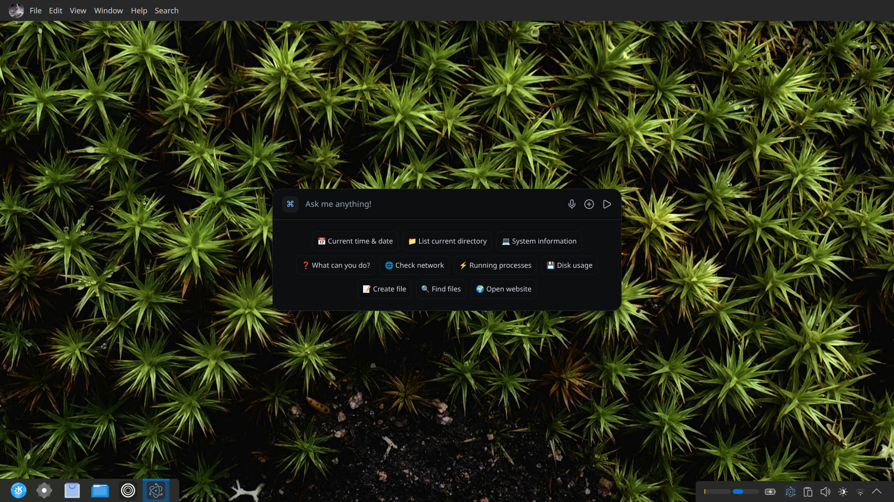

# Bonda Assistant



**Bonda Assistant** is an intelligent desktop AI assistant that combines the power of modern AI with seamless system integration. Built as a hybrid Electron + Python application, it features a sleek, transparent desktop interface powered by Groq's advanced language models and provides real-time command execution capabilities.

## 🚀 Features

### AI-Powered Desktop Assistant
- **Groq Integration**: Powered by Groq's Kimi model (`moonshotai/kimi-k2-instruct`) for fast, intelligent responses
- **System Command Execution**: Execute shell commands directly through natural language conversations
- **Cross-Platform Support**: Native support for Linux, Windows, and macOS with platform-specific optimizations
- **Voice Interaction**: Built-in speech-to-text capabilities for hands-free operation
- **Real-time Streaming**: Live response streaming for immediate feedback

### Modern Desktop Experience  
- **Transparent UI**: Beautiful, modern interface with transparent window styling
- **React + TypeScript**: Built with the latest web technologies for a responsive experience
- **Tailwind CSS**: Sleek, customizable styling with modern design patterns
- **Desktop Notifications**: System notifications to keep you informed of task completion

### Intelligent Automation
- **File Organization**: Smart file management with context-aware organization
- **Browser Integration**: Automated web searches and browser interactions
- **Mathematical Calculations**: Built-in calculator capabilities through shell commands
- **LaTeX Support**: Document and presentation creation with LaTeX compilation
- **Multi-language Support**: Automatic translation and English-only responses

### Developer-Friendly Architecture
- **Dual Backend**: TypeScript (Electron) + Python (FastAPI + LangChain) for maximum flexibility
- **Security-First**: Secure IPC communication with context isolation
- **Hot Reload**: Development environment with instant updates
- **Type Safety**: Full TypeScript support across the entire application

### Computer Use
- **Multi-Model Architecture**: Integration of sophisticated visual and visual grounding models for enhanced perception
- **Computer Vision Control**: Advanced vision-based system for automated desktop interaction and control
- **Human-Like Interaction**: Emulates natural human behavior for intuitive desktop navigation and manipulation
- **Intelligent Visual Processing**: Combines multiple vision models for comprehensive desktop environment understanding

## 🛠️ Technology Stack

### Frontend
- **Electron** - Cross-platform desktop framework
- **React 18** - Modern UI library with hooks
- **TypeScript** - Type-safe development
- **Tailwind CSS** - Utility-first styling
- **Vite** - Fast build tool and dev server

### AI & Backend
- **Groq AI SDK** - High-performance language model inference
- **AI SDK** - Streaming AI responses and tool calling
- **FastAPI** - Python backend for additional AI processing
- **LangChain** - AI application framework
- **Zod** - Runtime type validation

### System Integration
- **Node.js APIs** - File system and process management
- **Shell Command Execution** - Direct system command access
- **Desktop Notifications** - Native OS notification support
- **Audio Processing** - Speech-to-text capabilities

## 📋 Prerequisites

- **Node.js** 18+ 
- **Python** 3.11+
- **uv** (Python package manager)
- **Groq API Key** - Get yours at [groq.com](https://groq.com)
- **OpenAI API Key** - Get yours at [openai.com](https://openai.com)
- **Openrouter API Key** - Get yours at [openrouter.ai](https://openrouter.ai)

## ⚡ Quick Start

### 1. Clone & Install Dependencies

```bash
git clone https://github.com/Milansuman/bonda-assistant.git
cd bonda-assistant
npm install
```

### 2. Environment Setup

Create a `.env` file in the project root:

```env
GROQ_API_KEY=your_groq_api_key_here
VITE_GROQ_API_KEY=your_groq_api_key_here
OPENAI_API_KEY=your_openai_api_key_here
OPENROUTER_API_KEY=your_openrouter_api_key_here
```

### 3. Python Environment (Optional)

For additional AI processing features:

```bash
uv sync
```

### 4. Development

```bash
npm run dev
```

## 🔨 Building for Production

### Platform-Specific Builds

```bash
# Windows
npm run build:win

# macOS  
npm run build:mac

# Linux
npm run build:linux
```

### Universal Build
```bash
npm run build
```

## 🎯 Usage Examples

### Basic Conversation
Simply type your questions or requests in natural language:
- "What's the weather like today?"
- "Open my downloads folder"
- "Calculate 15% of 250"

### File Management
- "Organize my desktop files by type"
- "Find all PDF files in my documents"
- "Create a new folder called 'Project Assets'"

### System Operations
- "Show me running processes using the most memory"
- "Open Chrome and search for 'electron tutorials'"
- "Take a screenshot of my desktop"

### Development Tasks
- "Create a LaTeX presentation about machine learning"
- "Compile this TypeScript project"
- "Run the test suite"

## 🔧 Configuration

### AI Model Settings
The assistant uses Groq's Kimi model by default. You can modify the model in `src/main/lib/ai/bonda.ts`:

```typescript
const mainModel = groq("moonshotai/kimi-k2-instruct");
```

### System Behavior
Platform-specific behaviors can be customized in the system prompts within the same file. The assistant automatically detects your OS and applies appropriate command patterns.

## 🛡️ Security Considerations

- **Privileged Access**: The assistant can execute system commands - use responsibly
- **API Key Safety**: Never commit API keys to version control
- **Command Validation**: The AI includes built-in command safety guidelines
- **Sandboxed Environment**: Main window runs with `sandbox: false` for system access

## 🤝 Contributing

1. Fork the repository
2. Create a feature branch (`git checkout -b feature/amazing-feature`)
3. Commit your changes (`git commit -m 'Add amazing feature'`)
4. Push to the branch (`git push origin feature/amazing-feature`)
5. Open a Pull Request

## 📝 Development Guidelines

### Code Style
- Use TypeScript for all new code
- Follow ESLint configuration
- Use Prettier for code formatting
- Maintain type safety across the application

### Architecture Patterns
- Keep AI logic in `src/main/lib/ai/`
- Use secure IPC for main-renderer communication
- Follow Electron security best practices
- Separate concerns between Electron and Python backends

## 📄 License

This project is licensed under the MIT License - see the [LICENSE](LICENSE) file for details.

## 🙏 Acknowledgments

- [Groq](https://groq.com) for providing fast AI inference
- [Electron](https://electronjs.org) for the cross-platform framework
- [LangChain](https://langchain.com) for AI application tools
- [Vercel AI SDK](https://sdk.vercel.ai) for streaming AI responses

## 📞 Support

- **Issues**: [GitHub Issues](https://github.com/Milansuman/bonda-assistant/issues)
- **Discussions**: [GitHub Discussions](https://github.com/Milansuman/bonda-assistant/discussions)

---

**⚠️ Important**: This assistant has system command execution capabilities. Always review commands before execution and use trusted API keys.
